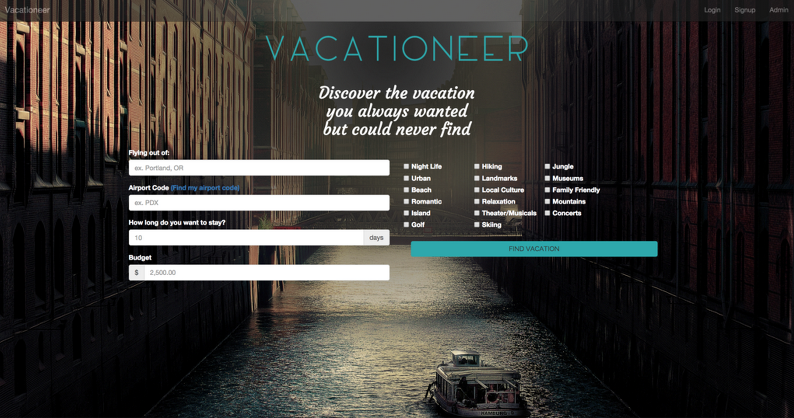
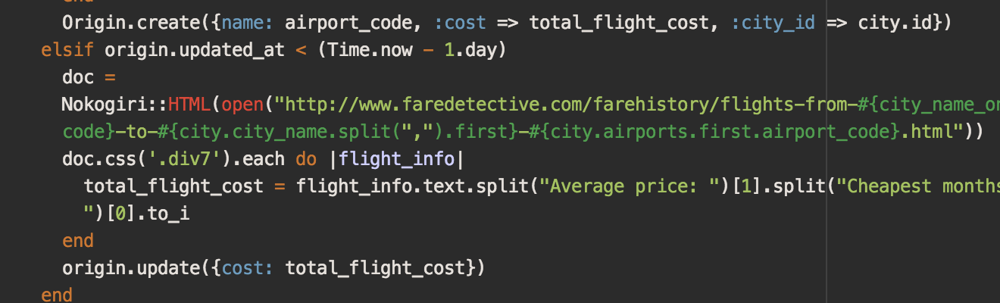

This is an app that a group of friends and I did as a group project. I had an idea long ago to make a travel website for people to simplify finding a vacation. I noticed that most website don’t make it easy to find a place you’d like to visit. I wanted something as simple as possible that would just return a list of places you can go when you enter your budget.

As shown below, someone would enter where they’re flying out of, how many days they want to vacation, and what the max amount of money they’d like to spend. On the right hand side, they can pick activities they want to do while there.

  

Vacationeer home page
When you click the button, it would return about a collage of places that would give you a cost breakdown of what place costs day-to-day.

A hard part of this was getting the flight cost information in a way that didn’t take a while. Before we went to web scraping, we tried to get an API for flight cost. For some reason, a lot of travel websites don’t like you using their API. We tried a bunch of different ones, but they never got back to us when asking for a key. So then we tried using Google’s API, which is by far the fastest way to get flight info.

  

Using Nokogiri for web scraping
For the most part, getting an API key from Google is relatively simple. However there was once catch with their flight API: You’re only allowed 50 queries a day before you get charge .03 cents a query after that. I thought that’d be fine. It’s doubtful we’ll make that many queries at first. And we also realized all four of us could generate API keys and switch them out which would give us 200 free queries a day. That was fine, so we went with it.

After we spent the better half of a day getting it working, we realized that for every result our app returned, it counted it as an individual query. So if you have a high budget and got 15 results back, that’d be 15 queries. After that, we realized this API wouldn’t be the most cost-efficient way, which is why we turned to scraping sites for the flight cost.

I would have liked to actually launch this project but I need to find an alternative way to get my information. I’ll look into APIs again and hopefully be able to find a working key on a travel website.

[Source](https://github.com/rheupler/vacationeer)
