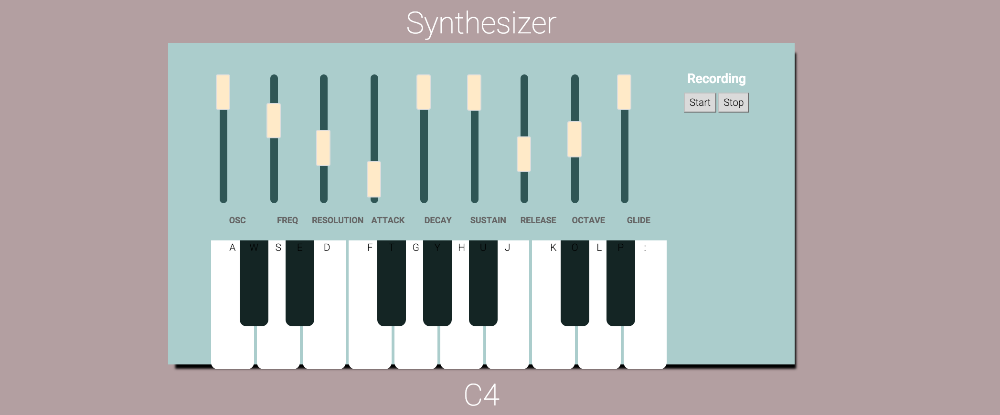
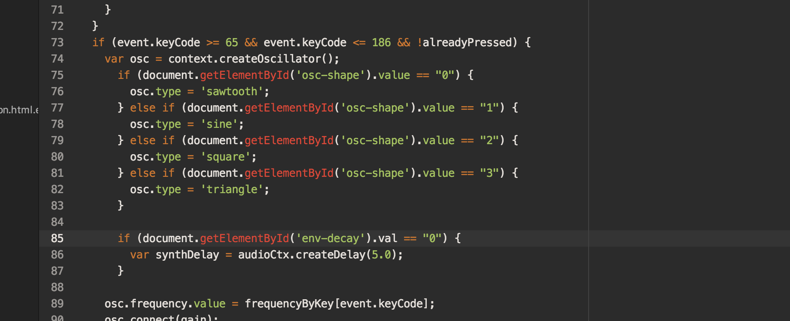

I had the idea of making a virtual synthesizer for a while now because music is always something I enjoyed making. I discovered the Web Audio API and it seemed interesting to me to actually program music. It’s been tough figuring it out but I configured it now so you can actually play the synth with your computer keyboard. However, there are some things I’m still working on doing, such as recording and playback of the keyboard. Ideally, I want something to be able to hit a button and record themselves playing something, then play it back so they can hear it. That’s the biggest hurdle I’m struggling with right now.

  

I used a template from codepen and customized it for the actual css synth.

  

This was built with HTML, CSS, & Javascript using the Web Audio API. The picture above is an example of how to change the oscillator type depending on the position of the switch on the keyboard.

[Source](https://github.com/rheupler/synth)
