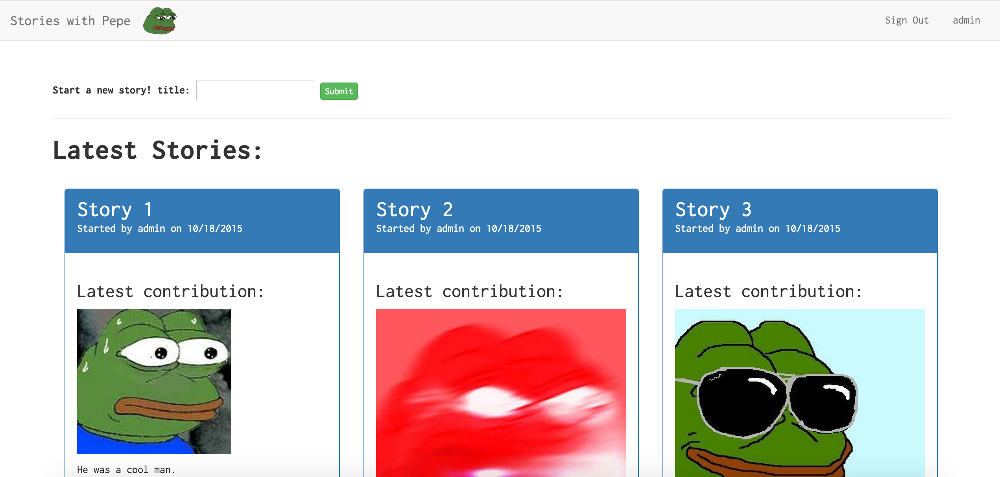
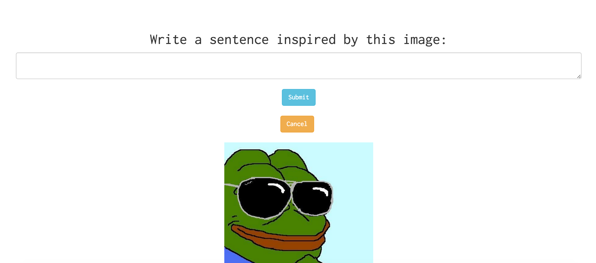
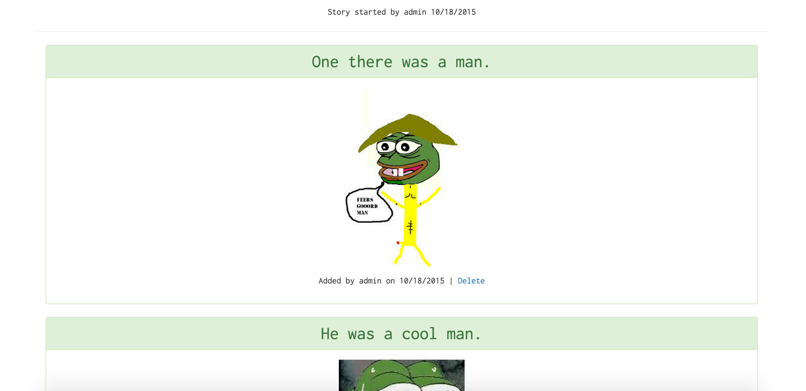
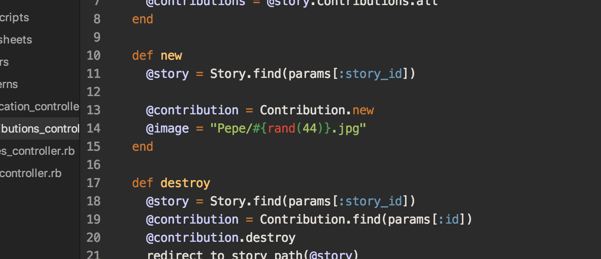
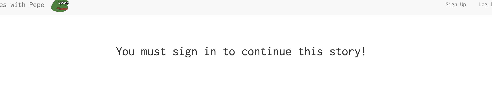

Stories with Pepe is a project idea that me and a friend had and built in two days. We had the task of making an app that lets users make a story by only writing a sentence based on an image. We didn’t know what exactly we wanted the theme to be. Then we found it. A whole gallery filled with the sad frog pictures.

  

Home page of Pepe
So we built an app based on lots of sad frog pictures. People can start a story by giving it a title. Then others can click on the story they want to contribute to

  
After the user submits a sentence, it gets added after the most recent sentence.
  

Randomly generated images for sentences

We just decided to locally store a folder full of Pepe images. We were going to link them right to the album online, get the json, and show a random image from it. But there were a lot of questionable images in the album. We just decided to pick the ones that were safe-for-work and save those to show.

  

I got folders full of Pepe!

We also go user authentication to work with the Devise gem. It was actually pretty easy to set up by following the documentation. It goes right into the User model and includes all the views you’ll need for signing in, signing up, loggin in, etc. I recommend it if you’re trying to get authentication to work. I’ve tried authentication in Ember and it was a lot more difficult than this.

  

User login
I’d like to actually launch this to get a working version. I tried deploying it to Heroku but kept getting an application error. I’ll try again and see if I can figure out what went wrong.

In the meantime, you can find the [source](https://github.com/rheupler/story_time) here.
