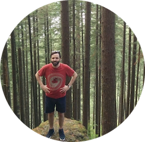

  

<h3>Web developer || Ignorant coffee lover</h3>

Originally from outside of Philadelphia, I moved to Portland, OR to study web development. Currently living back in Philadelphia. I enjoy hiking, kayaking, playing hockey, biking, and learning about new technologies.

<i>If you'd like to contact me, email would be the best way.</i>

## &#42;Languages
* JavaScript
* Ruby
* HTML5
* CSS3

## &#42;Frameworks/Libraries
* Rails
* Bootstrap
* JQuery
* Ember
* Sass
* Angular

## &#42;Tools/Data
* Git
* Postgres
* Active Record
* Rspec/Capybara
* Mocha/Chai
* Jekyll

<!--
## Preview


    https://cloud.githubusercontent.com/assets/754514/14509720/61c61058-01d6-11e6-93ab-0918515ecd56.png
    https://cloud.githubusercontent.com/assets/754514/14509716/61ac6c8e-01d6-11e6-879f-8308883de790.png

 -->
